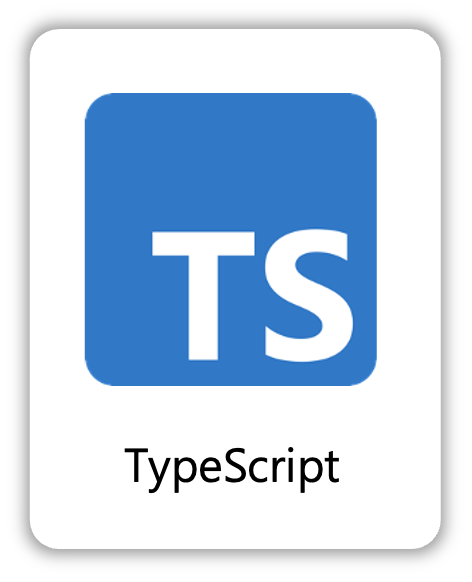

<a href="" target="_blank">
  
</a>

<br/>
<br/>

# 0. Getting Started (시작하기)
```
[서비스 링크](https://emotion-diary-neon.vercel.app/)
```


<br/>
<br/>

# 1. Project Overview (프로젝트 개요)
- 프로젝트 이름: 감정일기장
- 프로젝트 설명: 매일 자기전 오늘의 감정을 기록하는 일기장

<br/>
<br/>

# 2. Team Members (팀원 및 팀 소개)
| 양희연 | 
|:------:|
|  |
| FE |
| [GitHub]() |

<br/>
<br/>

# 3. Key Features (주요 기능)


- **CRUD 기능**:
  - create : 새로운 일기를 작성하고 로컬 스토리지에 저장합니다.
  - read : 월별로 작성된 일기를 읽을 수 있습니다.
  - update : 일기를 수정하고 로컬 스토리지에 저장합니다.
  - delete : 일기를 삭제하고 로컬 스토리지에 저장합니다.
  

- **일기 정렬**:
  - 최신순, 오래된 순서로 정렬할 수 있습니다.


<br/>
<br/>

# 4. Tasks & Responsibilities (작업 및 역할 분담)
|  |  
|-----------------|
| 양희연    |   | 
<ul>

<li>react 프론트앤드 개발</li></ul>|

<br/>
<br/>

# 5. Technology Stack (기술 스택)
## 5.1 Language
|  |  |
|-----------------|-----------------|
| Javascript    || 
| Typescript    |   |


<br/>

## 5.2 Frotend
|  |  |  
|-----------------|-----------------|
| React    |   | 
| Typescript    |  | 


<br/>

## 5.4 Cooperation
|  |  |
|-----------------|-----------------|
| Git    |      |

<br/>


